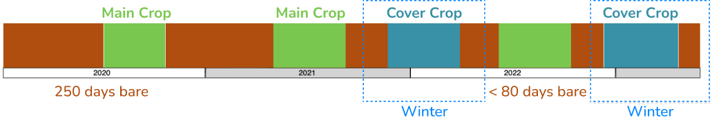

# FarmOn Coding Challenge

## Overview

Welcome to the FarmOn Coding Challenge! This challenge is designed to test your coding skills and your ability to apply them in the context of agriculture technology. FarmOn is focused on delivering farming insights, and this challenge reflects real-world scenarios you might encounter working with our technology and tech-stack.

**Choose one of the following options:**
## Option 1: Data Engineer Backend

### Objective
Develop an API endpoint that can integrate with FarmOn's system. This endpoint should return a single field for a given location with its carbon content and the carbon potential.

### Background
We would like to know how much carbon could be sequestrated on a field. You are given two datasets:
* Field delinations for agricultural parcels in an area in the Netherlands. The dataset contains the following information:
  * Field ID
  * Field area
  * Field geometry
  * Crop type
* Soil organic carbon (SOC) measurements for the same area.

You can have a look at the data here: [01 - FarmOn Coding Challenge.ipynb](pipelines%2Fnotebooks%2F01%20-%20FarmOn%20Coding%20Challenge.ipynb)

### Challenge
1. Look at the data and come up with an idea on how to calculate the carbon potential for each field. The carbon potential is the difference between the current SOC and the SOC that could be stored in the soil.
3. Store the information in the MongoDB database using the [/parcels/add_parcels](http://localhost:8080/parcels/add_parcels) endpoint.
4. Implement an API endpoint [here](api/app/routers/parcels.py) that returns a single field for a given location with its carbon content and the carbon potential. Don't forget to write and run tests for the API endpoint.
5. Present the data through a simple UI. You can use any technology you like. The UI should be able to show the carbon content and the carbon potential for a given location. Integrate the UI into the current docker setup.

### Requirements

1. **API Integration**: Service the data through a RESTful API.
2. **Scalability and Efficiency**: Your code should be efficient and scalable to handle large datasets (every field in Europe, for example).
3. **Documentation**: Provide clear instructions on how to run your code and a brief explanation of your approach.
4. **Clarity and Readability**: Write clear, concise, and well-structured code.
5. **Testing**: It is not required to have 100% test coverage, but you should write tests for the API endpoint.

## Option 2: Frontend Developer
### Objective
Develop a functional and useful UI that can integrate with FarmOn's system. The UI should should present the data provided by the API endpoint `GET http://localhost:8080/parcels/{parcel_id}`. There are two sample parcels (parcel_id 1 and 2).

Follow this [link](http://localhost:8080/redoc#tag/Parcels/operation/get_parcel_parcels__parcel_id__get) to see a detailed API documentation for the endpoint.

> [!IMPORTANT]  
> Don't use any other endpoint for the frontend challange. All other endpoints are ment to be used for the backend challeng.

### Background
This is one of the core features of FarmOn's system. The UI should at a glance show how the field has been doing over the years.

### Challenge

1. Setup a frontend framework of your choice + tailwind project and add it to the current docker compose setup.
2. Implement a single page showing the data. Use the image below as an inspiration:

4. Add basic styling to the page.
5. Add a map that shows the field geometry.

### Requirements
1. **Frontend Integration**: Integrate a docker for next.js into the current docker setup.
2. **Functionality**: The UI should be able to show the the data in a meaningful way. 
3. **Documentation**: Provide clear instructions on how to run your code and a brief explanation of your approach.
4. **Clarity and Readability**: Write clear, concise, and well-structured code.
5. **Styling**: The UI should be visually appealing and easy to use.

## Submission Guidelines

1. **Code Repository**: Submit your code in a Git repository (GitHub).
2. **Documentation**: Extend the README with:
   - Setup instructions
   - How to run the code
   - A brief explanation of your approach
   - A simple test case

## Evaluation Criteria

- **Code Quality**: Readability, structure, and adherence to standard practices.
- **Functionality**: Accuracy and efficiency.
- **Innovation**: Creative solution and approach.

## Deadline

Submit your solution latest 5 working days after receiving the challenge.

## Questions

For any questions or clarifications, please contact [thimm@farmonapp.com](mailto:thimm@farmonapp.com).

Good luck, and we look forward to your innovative solutions!

## How to get started

1. Create a new branch
2. Run `docker compose --env-file .env.example up --build`
3. The API documentation is available on [http://localhost:8000/docs](http://localhost:8000/docs)
4. A jupyter lab instance is available on [http://localhost:8888](http://localhost:8888). Password is `farmon`

## Services
- **API Docs**: [http://localhost:8000/redoc](http://localhost:8000/redoc)
- **Jupyter Lab**: [http://localhost:8888](http://localhost:8888)
- **MongoDB**: [http://localhost:27017](http://localhost:27017)
- **Mongo Express**: [http://localhost:8081](http://localhost:8081)

You can find the passwords in the [.env.example](.env.example) file.

## Tips
- Keep in mind that geo data has different types of projections. Make sure to use the right one for your calculations.
- When connecting to the API through jupyter lab, make sure to use the right URL. It should be `http://api:8080` instead of `http://localhost:8080`.
- The API is built with FastAPI. You can find the code in the [api](api) folder.
